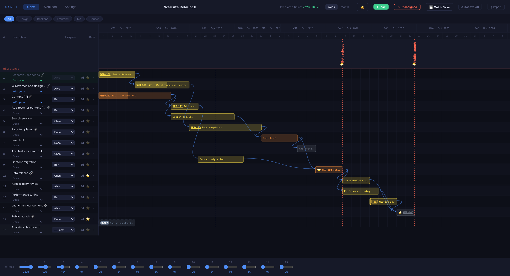
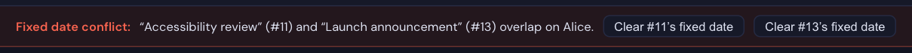
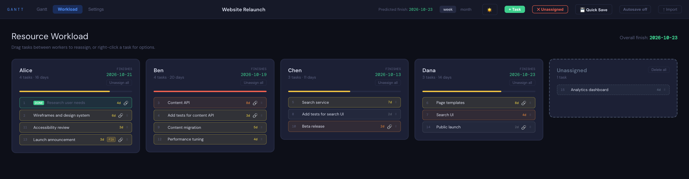
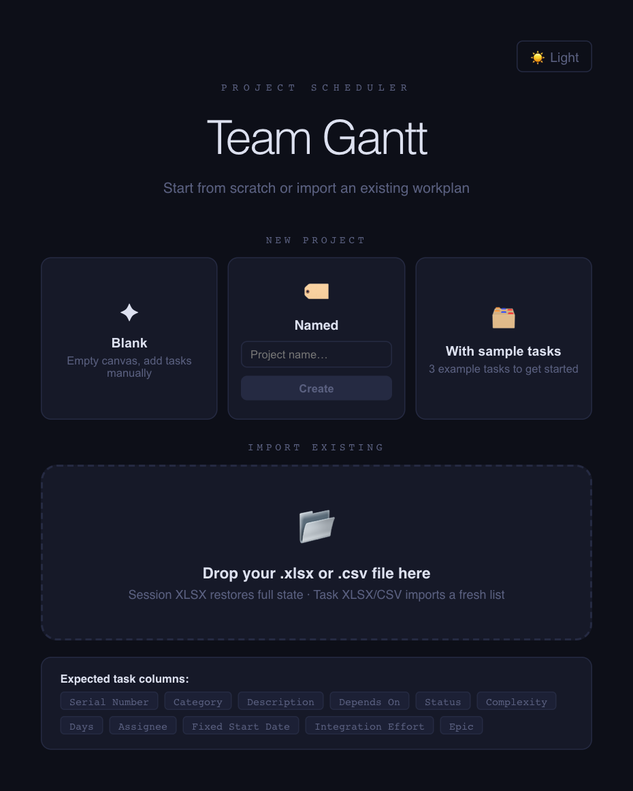
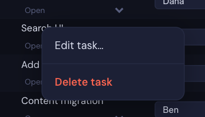
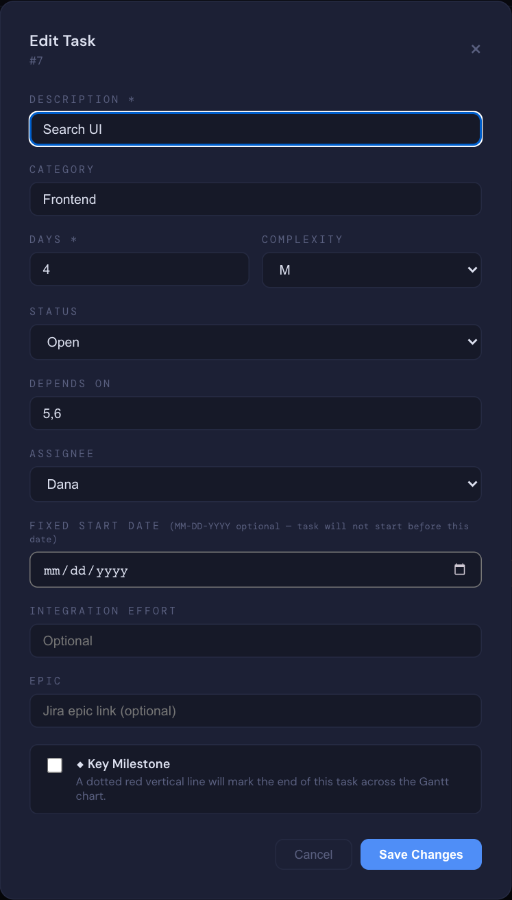
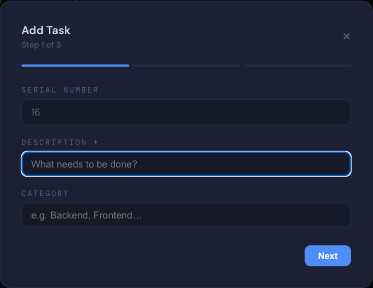

# Team Gantt

A dynamic Gantt chart scheduler for software teams. Import your task spreadsheet, assign work to team members, and get an instant visual schedule with predicted finish dates — respecting working days, public holidays, and personal vacation time.



---

## Features

### 📊 Gantt Chart
- Task bars with computed start and end dates
- Smooth curved dependency arrows (Finish-to-Start) rendered as SVG bezier curves
- Today marker line for at-a-glance progress context
- Color-coded bars by task status: Open, In Progress, Completed
- Per-task progress sliders (% complete) shown inline on bars
- Inline status selector per task — change status directly in the task list
- Completed tasks are visually locked: non-draggable, assignee disabled, skipped by optimizer
- Week and month zoom levels
- Filter tasks by category
- Test tasks are highlighted with a distinct color and TEST badge
- **Fixed Start Date** — optional per-task constraint; the task will not start before the given date (set via Edit Task modal or imported from a `Fixed Start Date` column). Shown as a yellow left-edge stripe and a **FIX** badge on the bar. Non-fixed tasks automatically schedule around a fixed task's reserved slot on the same resource; if two fixed tasks still collide, a dismissible conflict banner appears at the top of the Gantt tab with one-click buttons to clear either task's fixed date
- **Key Milestones** — flag any task as a key milestone via the ⭐ button on the task row or via the Edit Task modal. A dotted red vertical line crosses the entire chart at the task's end date, and a vertical label row above the bars shows each milestone's name. Hover the label for a tooltip with the full name
- **Epic** — optional per-task Jira reference link (set via Add/Edit Task modal or imported from an `Epic` column). The ticket key (e.g. `ZENG-469932`) is shown as a clickable link directly on the Gantt bar, plus a 🔗 icon next to the task description and on Workload cards — click to open the Jira epic in a new tab
- **+ Task** — toolbar button opens a step-by-step modal to add a new task
- **Edit task** — right-click any task row → **Edit task…** to change description, category, days, complexity, status, dependencies, assignee, fixed start date, integration effort, or Epic (Serial Number is read-only)
- **Delete task** — click the `×` button on any row, or right-click → **Delete task** (confirmation required)
- **Delete all unassigned** — toolbar button removes every task with no assignee at once (visible only when unassigned tasks exist, confirmation required)

<table>
  <tr>
    <td width="60%"></td>
    <td width="40%"></td>
  </tr>
  <tr>
    <td><sub>Milestones (⭐ and dotted red lines), a fixed start date (<b>FIX</b>, yellow edge) and Epic links on the bars</sub></td>
    <td><sub>Conflict banner when two fixed-date tasks overlap on the same person</sub></td>
  </tr>
</table>

### 👥 Resource Management
- Assign tasks to team members via dropdown in the Gantt view
- Add new resources in Settings — unassigned tasks auto-distribute using a load-balancing algorithm (fewest days first)
- **Rename** a resource with the ✎ button on its chip in Settings (Enter to save, Esc to cancel) — the new name is applied everywhere: task assignments, vacation days, workload cards, exports, and Optimize undo history. Renaming to a name that already exists (case-insensitive) is blocked
- **Remove** a resource with × in Settings (confirmation required) — their tasks move to the Unassigned card and their vacation days are deleted
- Each person works on one task at a time (no parallel splitting)

### 📋 Workload Tab



- Per-person cards showing task list, total days, and predicted finish date
- Relative workload bar (green → yellow → red) for quick overload spotting
- **Drag and drop** tasks between worker cards to reassign (completed tasks are locked)
- **Right-click** any task for a context menu to edit, set status, reassign, or delete the task
- **Unassign all** button on each resource card — moves all of that person's tasks to Unassigned (confirmation required)
- **Unassigned card** — a dedicated card lists all tasks with no assignee; drag a task from it to any resource card to assign, or drop any task onto it to unassign; includes a **Delete all** action to remove all unassigned tasks at once
- Completed tasks show a **DONE** badge and cannot be dragged or reassigned
- All changes recalculate the Gantt instantly

### ⚙️ Scheduling Engine
- 5-day work weeks (Monday–Friday)
- Skips weekends automatically
- Configurable public holidays (global)
- Per-person vacation days
- Tasks scheduled by Serial Number order when multiple are ready to start
- Dependency-aware: a task won't start until all its dependencies are complete
- Optimization (experimental, off by default) minimizes total project duration
- Optimization avoids resource idle gaps (contiguous work per resource)

### ⚡ Optimization (experimental)
- **Off by default.** Enable it in **Settings → Experimental Features** — a confirmation warns that it is *experimental, use at your own risk*. The choice is remembered in this browser. Turning it off hides the button without a prompt; ↶ Undo stays available for an optimization you already ran
- The Optimize button redistributes tasks to balance workload and shorten the overall project finish date
- Tasks are grouped into **units** (a non-test task + all test tasks that depend on it) and always move together
- Units are allocated in **priority order**: tasks with no dependencies first, then tasks that the most other tasks depend on — critical-path work starts as early as possible
- The optimizer tries every possible unit move each iteration and picks whichever gives the lowest overall finish date (greedy makespan minimization)
- **Completed tasks are never moved** — their assignments are locked
- **Tasks with Status = Completed are excluded on import** — they do not appear in the Gantt
- Dependencies are respected; the full scheduling engine (calendar-aware) is used to compare outcomes
- Undo restores the pre-optimization assignments

### 🎨 Themes
- Dark mode and Light mode
- Toggle with the ☀️ / 🌙 button in the top bar or import screen

### 💾 Save & Restore Sessions


- **New Project** — from the start screen, create a blank project, a named one, or load sample tasks, instead of importing a file
- **Project name** — editable in the top bar or in Settings; saved in the session file and used as the default save filename (`<name> gantt.xlsx`)
- **💾 Quick Save** — toolbar button available on every tab; writes directly back to the file you loaded or last saved without showing a dialog. On the very first save it opens a file picker and remembers the chosen path for all future Quick Saves. If the browser doesn't support the File System Access API it falls back to a triggered download
- **⟳ Autosave** — toolbar toggle next to Quick Save. When on, the session is written to the same file about a second after every change (tasks, assignments, status, progress, fixed dates, milestones, resources, holidays, vacations, project start) — no dialogs. Turning it on before a file has been chosen opens the save picker once. The on/off preference is remembered in the browser. Available only in browsers with the File System Access API (Chrome, Edge); hidden elsewhere. If the browser hasn't granted write access (e.g. after dropping in a session file on a fresh page load), the button shows **Autosave paused** — click Quick Save once to grant access and autosave resumes
- **Save Session (XLSX)** (Settings tab) — same output as Quick Save; also stores the file handle so Quick Save targets it afterwards
- Restoring is as simple as re-importing the saved file — all assignments, progress, holidays, vacations, and resources are fully recovered
- No database or account required

---

## Getting Started

### Prerequisites

- [Node.js](https://nodejs.org) **v18 or higher** (required by Vite 8)

### Installation

```bash
git clone https://github.com/ZahirJ/gantt.git
cd gantt
npm install
npm start
```

The app opens at `http://localhost:5173`.

### Quick Start

Want to explore first? Drop [`examples/demo-project.xlsx`](examples/demo-project.xlsx) onto the start screen — it's the fictional "Website Relaunch" project used in these screenshots.

**1. Start a project.** Create a blank or named project, load the sample tasks, or drop in your own `.xlsx` / `.csv` task file (see [Expected Columns](#expected-columns)). Dropping a saved session file restores everything.



**2. Read the schedule.** The Gantt tab computes every task's dates from dependencies, working days, holidays and vacations. Filter by category, switch week/month zoom, and assign people from the dropdown on each row.

**3. Add and edit tasks.** Click **+ Task** in the toolbar, or right-click any row → **Edit task…** to change its details, dependencies, assignee, fixed start date, milestone flag or Epic link.

<table>
  <tr>
    <td valign="top"></td>
    <td valign="top"></td>
    <td valign="top"></td>
  </tr>
</table>

**4. Balance the team.** In the **Workload** tab, drag tasks between people (or onto **Unassigned**) and watch finish dates update.

**5. Save your work.** Click **💾 Quick Save** (it asks where to save the first time), or turn on **Autosave** to save after every change. Re-import the saved file anytime to continue.

---

## Importing Your Task File

The app accepts `.xlsx` and `.csv` files. Drag and drop onto the import screen or click to browse.

### Expected Columns

| Column | Description |
|---|---|
| `Serial Number` | Unique task identifier — used for dependency references |
| `Category` | Task category (e.g. Backend, Frontend) — used for filtering |
| `Description` | Task name / description |
| `Depends On` | Comma-separated Serial Numbers this task depends on. Use `0` or leave blank for no dependencies. Column name is case-insensitive (`Depends on` also accepted) |
| `Status` | `Open`, `In Progress`, `Completed`, or `Open(May not need fix)` |
| `Complexity` | T-shirt size: `S`, `M`, `L`, `XL` — used as a fallback if Days is empty |
| `Days` | Estimated working days |
| `Assignee` | Team member name — pre-populates assignments on import |
| `Integration Effort` | `Yes` / `No` — informational, not used in scheduling |
| `Fixed Start Date` | Optional. `YYYY-MM-DD` — task will not start before this date regardless of dependencies |
| `Key Milestone` | Optional. `true` / `yes` / `1` — marks the task as a key milestone |
| `Epic` | Optional. Full Jira ticket URL (e.g. `https://yourorg.atlassian.net/browse/PROJ-123`) — shown as a clickable link. Also accepts `Jira Epic` / `Jira Link` as column names |

> **Note:** The `Serial Number` column supports Excel `=ROW()-1` style formulas — they are evaluated automatically on import.

### Dependency Format

Dependencies in `Depends On` are matched by Serial Number. Use comma or semicolon-separated values:

```
19
3,5
14;22;30
```

A value of `0` or an empty cell means no dependencies.

### Complexity → Days Fallback

If the `Days` column is empty, the app falls back to the `Complexity` column using these defaults:

| Size | Days |
|---|---|
| S | 1 |
| M | 3 |
| L | 5 |
| XL | 10 |

---

## Session Files

**Saving:** Go to **Settings → Export → Save Session (XLSX)**. This creates a `gantt_session.xlsx` with three sheets:

| Sheet | Contents |
|---|---|
| `Schedule` | All tasks with computed start/end dates, assignees, progress % |
| `Session` | Project start, theme, resources, holidays, vacation days, assignments, progress, task statuses, fixed start dates, milestones |
| `Workload` | Per-person summary: tasks, total days, finish date |

With **Autosave** on, this file is kept up to date automatically after every change.

**Restoring:** Drop the session file onto the import screen. The app automatically detects the Session sheet and restores your full state.

---

## Settings Reference

| Setting | Description |
|---|---|
| Project Name | Shown in the top bar and used as the default save filename |
| Project Start Date | The earliest possible start date for any task |
| Team Resources | Add, rename (✎) or remove (×) team members. Adding a new member triggers auto-rebalancing of unassigned tasks; renaming updates the name everywhere; removing moves their tasks to Unassigned |
| Public Holidays | Dates skipped for all team members |
| Vacation Days | Per-person dates to skip during scheduling |
| Experimental Features | **Enable ⚡ Optimize** — off by default; enabling asks you to confirm it is experimental and used at your own risk. Remembered per browser |

---

## Export Options

| Option | Description |
|---|---|
| 💾 Quick Save | Toolbar button on every tab — saves directly to the previously used file (no dialog). Shows a picker on first use and remembers the path. Falls back to a download if the File System Access API is unavailable |
| ⟳ Autosave | Toolbar toggle — saves to the current session file automatically after every change. Chrome/Edge only; shows *paused* until write permission is granted via Quick Save |
| 💾 Save Session (XLSX) | Full session snapshot (Settings tab) — opens a save dialog; also registers the file for Quick Save |
| Export CSV | Scheduled task list with dates — for use in other tools |
| Print / PDF | Prints the current view via the browser print dialog |

---

## Project Structure

```
index.html                         # Vite entry point
docs/screenshots/                  # README screenshots (generated by npm run screenshots)
examples/
├── demo-project.xlsx              # Fictional demo session file used for the screenshots
└── Template-Workplan.xlsx         # Example task file (import format, not a session file)
scripts/screenshots.mjs            # Regenerates the demo file and README screenshots
src/
├── App.jsx                        # UI, import/export, drag-and-drop, theme
├── App.test.jsx                   # Smoke tests for the import screen
├── App.integration.test.jsx       # Integration tests for Gantt, Workload, and Settings (resource rename/remove)
├── App.fixedstart.test.jsx        # Integration tests for fixed start dates and conflict resolution
├── App.quicksave.test.jsx         # Integration tests for Quick Save and Autosave (file handle, picker, fallback, permissions)
├── index.jsx                      # React root mount
├── setupTests.js                  # Vitest global setup
├── components/
│   ├── AddTaskModal.jsx           # Multi-step modal for creating a new task
│   ├── EditTaskModal.jsx          # Single-page modal for editing an existing task
│   ├── ConfirmDialog.jsx          # Reusable confirmation dialog for destructive actions
│   └── ConfirmDialog.test.jsx     # Unit tests for ConfirmDialog
└── utils/
    ├── scheduleUtils.js           # Pure scheduling helpers, fixed-date collision detection, levelOptimize
    ├── scheduleUtils.test.js      # Unit tests for scheduling, collisions, and levelOptimize
    ├── taskMutations.js           # Pure helpers for task deletion/unassignment and resource rename/removal
    ├── taskMutations.test.js      # Unit tests for task mutation helpers
    ├── optimize.js                # Legacy greedy optimizer (kept for its test suite)
    ├── optimize.test.js           # Unit tests for the legacy optimizer
    └── optimize.bench.test.js     # Performance / scale tests
vite.config.js                     # Vite build config
vitest.config.js                   # Vitest test config
```

**Updating screenshots:** after UI changes, run `npm run screenshots`. It regenerates `examples/demo-project.xlsx`, starts its own dev server, and captures every image in `docs/screenshots/` with headless Google Chrome (must be installed) and a frozen clock, so the output is reproducible.

No external state management or backend required.

---

## Tech Stack

### Runtime
| Library | Purpose |
|---|---|
| **React 19** | UI components and state management |
| **ExcelJS** | Excel (.xlsx) import and export |
| **HTML5 Drag and Drop API** | Task reordering in the Workload view |
| **SVG** | Gantt bars, dependency arrows, grid lines |

### Build & Dev tooling
| Tool | Purpose |
|---|---|
| **Vite 8** | Dev server and production bundler (requires Node ≥ 18) |
| **@vitejs/plugin-react** | JSX transform and React Fast Refresh |
| **Vitest** | Unit and integration test runner |
| **@testing-library/react** | React component test utilities |

No CSS framework, no external component library, no backend.

---

## Known Limitations

- Dependency type is Finish-to-Start only (Start-to-Start and Finish-to-Finish not yet supported)
- Progress sliders in the Gantt view show the first 18 tasks only — scroll the Workload tab to see all
- Undo is available for the Optimize action only; general undo/redo is not yet supported — turn on Autosave or use Save Session frequently to preserve checkpoints (autosave overwrites the same file, so save a copy under a new name if you want a restorable checkpoint)
- Print/PDF exports the current browser view; for best results use the Gantt tab at month zoom

---

## License

MIT
